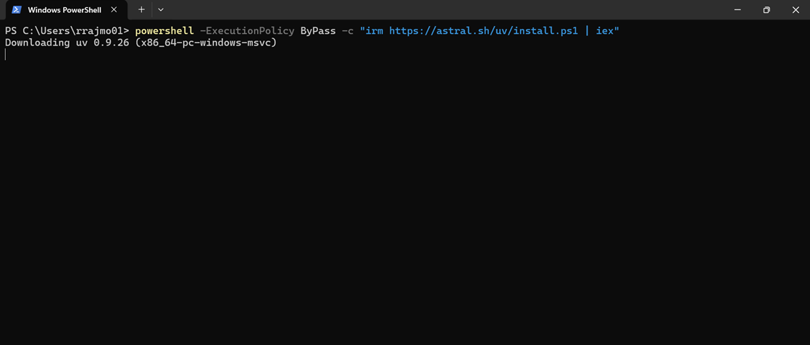
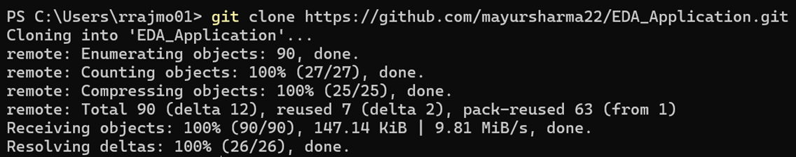
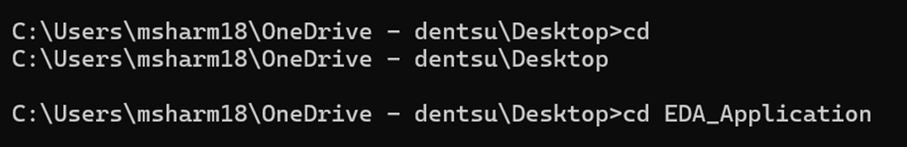
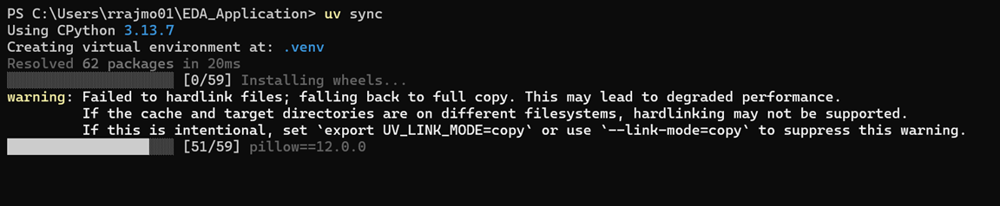
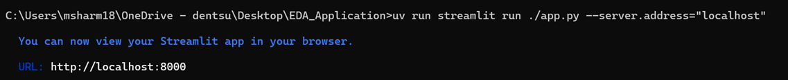

# **EDA_Application**

A Streamlit-powered toolkit that helps users **prepare raw marketing/analytics data** (single or multi-file) and **generate a formatted Excel EDA workbook** with pivots, totals, and publication-ready charts. The app ships with two tools accessible from the sidebar:

- **Data Preparation** — interactively clean, harmonize, *melt*, and group datasets; export a single CSV or a ZIP split by a chosen dimension.
- **EDA Generation** — upload a CSV and produce a polished Excel workbook & PPT Deck with weekly, totals, quarterly views, and color‑customized charts.

---
# 🚀 Quick Start
When the app opens in your browser, use the sidebar to switch between **Data Preparation** and **EDA Generation**.

---
# 📁 Repository Structure
```
EDA_Application/
├── app.py
├── src/
│   ├── data_preparation/
│   │   └── eda_data_processing.py
│   └── eda_generation/
│       ├── eda_excel_app.py
│       └── eda_excel_generation.py
        └── eda_ppt_generation.py
```
- **`app.py`** — Streamlit entry point and navigation between the two tools.
- **`src/data_preparation/eda_data_processing.py`** — the **Data Preparation** tool (single-file and multi-file flows).
- **`src/eda_generation/eda_excel_app.py`** — the **EDA Generation** Streamlit UI.
- **`src/eda_generation/eda_excel_generation.py`** — builds Excel sheets, pivots, totals, and charts.
- **`src/eda_ppt_generation.py`** — generates summary PPT charts.

---
# 🧭 Usage
## 1) Data Preparation (CSV/XLSX → CSV)
**What it does**
- Upload one or more files (CSV or Excel) and preview them.
- Pick/rename a **date column** with robust parsing.
- Create/use a **channel column**.
- Rename columns, add custom fields.
- Melt selected metric columns.
- Group by chosen dimensions.
- Export harmonized CSV or ZIP breakdown.

**How to use**
1. In sidebar, choose **Data Preparation**.
2. Upload Wide/Semi‑Wide format datasets.
3. Configure date/channel/columns.
4. Melt/group/export.

---
## 2) EDA Generation (CSV → Excel & PPT)
**What it does**
- Upload long-format CSV and preview.
- Configure date, granularity, metrics, and breakdowns.
- Customize visual colors.
- Generate Excel & PPT deck with pivots, charts, and summary sheets.

**How to use**
1. Choose **EDA Generation**.
2. Choose parameters.
3. Export Excel & PPT deck.

---
# 🧩 Design Notes
- **Data Preparation** accepts CSV/XLSX in Wide/Semi‑Wide format; **EDA Generation** expects CSV in long format.
- Sheet names must be ≤ 31 characters.

---
# 🛠 Troubleshooting
- Validate color hex codes.
- Clean numeric columns before converting.

---
# 🌐 App URL
- https://eda-application-3365883928105847.aws.databricksapps.com/

---
# 📌 Run Application on Local Machine
## 🖥️ Setup Guide (Windows)
Below is the complete one‑time setup process for Windows.

---
### ✅ Prerequisites
- Windows OS
- PowerShell (Admin)
- Git installed
- Internet connection

---
### 🔧 Step 1: Install UV (Python Environment Manager)
UV is a fast environment & package manager. To install, open PowerShell (Admin) and run:
```
powershell -ExecutionPolicy ByPass -c "irm https://astral.sh/uv/install.ps1 | iex"
```

---
### 📥 Step 2: Clone the Repository
1. Visit GitHub repo: https://github.com/mayursharma22/EDA_Application
2. Copy the HTTPS clone URL.
3. In terminal (cmd), navigate to your desired folder and run:
```
git clone https://github.com/mayursharma22/EDA_Application.git
```


---
### 📂 Step 3: Set Up Environment
1. Navigate to the cloned repository folder.


2. Install required dependencies: Open Terminal and install dependencies using below command line.
```
uv sync -n
```


---
## ▶️ Run the Application
Run Streamlit using UV from the project folder: After setting up the application on your local machine, simply run the following command in your terminal (CMD/Git Bash) from the folder where you cloned the repository.

```
uv run streamlit run app.py --server.address="localhost"
```


### 🎉 Expected Result
Your app launches at: **http://localhost:8000**
If it does not open automatically, visit the URL manually.

---
